<div align="center">

<!-- HEADER - DEEP SPACE STARFIELD -->


<br/>

<!-- TYPING SVG - TERMINAL INIT -->
<a href="https://potanet.work">
   système initialisé_"/>
</a>

<br/>

<!-- BLOC TERMINAL - SYSTEM READOUT -->
```
 POTANET SYSTEMS
 ═══════════════════════════════════
 status    ............ EN LIGNE
 signal    ............ STABLE
 secteur   ............ INCONNU
 protocole ............ potanet.work
```

<br/>

<!-- SEPARATEUR COSMIQUE -->
`[ • ]   [ • ]   [ • ]`

<br/>

<!-- BADGE ENTREE RESEAU -->
<a href="https://potanet.work">
  
</a>

<br/>

<!-- SIGN-OFF -->
<sub>transmission terminée. rien d'autre à voir ici.</sub>

</div>
